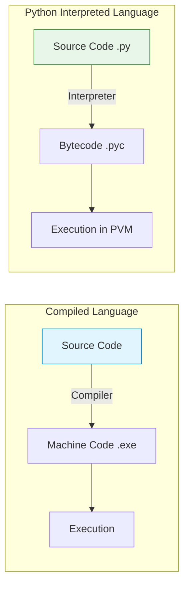

# Day 1: Python Fundamentals, Variables, Data Types, and Operators

Welcome to Day 1 of the Python Mastery Course. Today, we lay the foundation of your Python journey.

---

## 1. What is Python?

Python is a high-level, interpreted, dynamically typed, and general-purpose programming language. Created by Guido van Rossum and released in 1991, it focuses heavily on code readability.

### Visualization: Interpreted vs Compiled

Python is an **interpreted** language. Unlike C++ which compiles all code into machine language before running, Python translates and executes the code line-by-line.



---

## 2. Why choose Python? & 3. Common Uses

- **Beginner-friendly:** Uses English-like syntax and indentation instead of curly braces.
- **Versatile Ecosystem:** Libraries like Pandas for data, Django for web, and TensorFlow for AI.
- **Real-World Uses:** 
  - **Data Science:** Analyzing trends, creating graphs.
  - **Automation:** Writing scripts to sort files or scrape websites.
  - **Web Development:** Backends for apps like Instagram and Spotify.

---

## 4. Basic Python Syntax

Python emphasizes clean structure. 

- **Indentation:** You must use whitespace (usually 4 spaces) to define code blocks. 
- **Comments:** Text preceded by `#` is ignored by the interpreter and used for documentation.

```python
# Check if a user is an adult
age = 20
if age >= 18:
    # Notice the 4 spaces below!
    print("You are an adult.")
```

---

## 5. Variables in Python

A variable is a named container that stores data. Because Python is **dynamically typed**, you don't need to declare what type of data the variable will hold beforehand.

### Visualization: Variables as Name Tags (Memory Pointers)

In Python, variables aren't "boxes" that contain values. They are **name tags** attached to objects in memory.

```mermaid
graph LR
    A[Variable: <code>age</code>] -->|points to| B((Value: 25))
    C[Variable: <code>name</code>] -->|points to| D((Value: "Alice"))
    E[Variable: <code>user</code>] -->|points to| D
    
    classDef var fill:#ffcc80,stroke:#e65100,color:#000;
    classDef val fill:#81d4fa,stroke:#01579b,color:#000;
    class A,C,E var;
    class B,D val;
```
*Notice how multiple variables (`name` and `user`) can point to the exact same object in memory!*

### 🛠️ Code Explanation & Dry Run

```python
x = 10         # Step 1
y = 10         # Step 2
x = "Hello"    # Step 3
```

**Dry Run Analysis:**
- **Step 1:** An integer object `10` is created in memory. The label `x` is attached to it.
- **Step 2:** Python sees `10` already exists. It attaches the label `y` to the *same* `10` object to save memory.
- **Step 3:** A new string object `"Hello"` is created. The label `x` is detached from `10` and attached to `"Hello"`. The label `y` still points to `10`.

---

## 6. Data Types in Python

Python provides several built-in structures to hold data.

```mermaid
mindmap
  root((Python Data Types))
    Numeric
      int (5)
      float (3.14)
    Sequence
      str ("Hello")
      list ([1, 2, 3])
      tuple ((1, 2))
    Mapping
      dict ({"key": "value"})
    Set
      set ({1, 2, 3})
    Boolean
      bool (True / False)
```

### 🛠️ Code Explanation & Dry Run: Type Casting

```python
price_str = "15.50"         # Line 1
price_float = float(price_str) # Line 2
quantity = 2                # Line 3
total = price_float * quantity # Line 4
```

**Dry Run Analysis:**
- **Line 1:** `price_str` is stored as text (String). Type: `str`.
- **Line 2:** The `float()` function converts the text `"15.50"` into a math-ready decimal `15.5`. It is assigned to `price_float`.
- **Line 3:** `quantity` is assigned integer `2`. Type: `int`.
- **Line 4:** Python multiplies a float (`15.5`) by an int (`2`). The result is automatically promoted to a float (`31.0`). `total` is `31.0`.

---

## 7. Operators in Python

Operators allow you to manipulate data.

1. **Arithmetic:** `+`, `-`, `*`, `/` (float division), `//` (floor division), `%` (modulo), `**` (exponentiation).
2. **Comparison:** `==` (equals), `!=` (not equals), `>`, `<`, `>=`, `<=`.
3. **Logical:** `and`, `or`, `not`.

### 🛠️ Code Explanation & Dry Run: Logic Operators

```python
is_weekend = True           # Step 1
is_raining = False          # Step 2
go_hiking = is_weekend and not is_raining  # Step 3
```

**Dry Run Analysis:**
- **Step 1 & 2:** Variables setup.
- **Step 3 Evaluation:** 
  1. Python resolves `not is_raining`. Since it's False, `not False` becomes `True`.
  2. The expression is now `True and True`.
  3. The `and` operator requires both sides to be True. Since they are, it evaluates to `True`.
  4. `go_hiking` is set to `True`.

---

## 🚀 Mini-Project: Sales Analysis Script

Let's tie everything together with a comprehensive example.

```python
# 1. Setup Data (Variables, int, float)
coffee_price = 4.50
daily_sales_cups = [120, 145, 130] # list

# 2. Arithmetic
total_cups_sold = sum(daily_sales_cups)
estimated_revenue = total_cups_sold * coffee_price

# 3. Logic & Comparison
goal_met = total_cups_sold >= 400

# 4. Output
print(f"Revenue: ${estimated_revenue}")
print(f"Goal Met: {goal_met}")
```

### 🧠 Step-by-Step Dry Run

| Step / Code | Variables in Memory | State / Evaluation |
| :--- | :--- | :--- |
| `coffee_price = 4.50` | `coffee_price = 4.5` (float) | Setup constant |
| `daily_sales_cups = [...]`| `daily_sales_cups = [120, 145, 130]` (list) | Setup data sequence |
| `sum(...)` | `120 + 145 + 130` | Internal calculation returns `395` |
| `total_cups_sold = sum(...)` | `total_cups_sold = 395` (int) | Result assigned |
| `total_cups_sold * coffee_price` | `395 * 4.5` | Internal calculation returns `1777.5` |
| `estimated_revenue = ...` | `estimated_revenue = 1777.5` (float) | Result assigned |
| `total_cups_sold >= 400` | `395 >= 400` | Evaluates to `False` |
| `goal_met = ...` | `goal_met = False` (bool) | Boolean assigned |
| `print(f"Revenue...")` | | Outputs: `Revenue: $1777.5` |
| `print(f"Goal Met...")`| | Outputs: `Goal Met: False` |

> [!TIP]
> **Why do we use lists?** If we didn't use `[120, 145, 130]`, we would have needed three separate variables (`day1=120`, `day2=145`, `day3=130`). Lists group related data together, allowing functions like `sum()` to operate on all of them at once!
