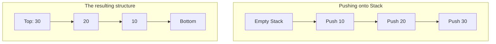

# Day 10 Detailed Notes: Understanding Stacks

Welcome to Day 10! Today we dive into one of the most elegant and commonly used data structures in computer science: **The Stack**.

---

## 1. The LIFO Principle

A Stack operates on a **Last In, First Out (LIFO)** principle.
Imagine a stack of plates at a buffet. When a clean plate is added, it goes on the **top** of the pile. When someone needs a plate, they take the one off the **top**. The last plate added is the first one removed.

Many systems use stacks implicitly:
- The **"Undo"** button in your text editor (reverses the most recent action).
- Your web browser's **"Back"** button.
- The **Call Stack** in programming (which handles recursion!).

---

## 2. Core Stack Operations

A standard stack has four primary operations. In a well-implemented stack, all of these operations take **O(1)** Constant Time!

1. **`push(item)`**: Adds an item to the top of the stack.
2. **`pop()`**: Removes and returns the item from the top of the stack.
3. **`peek()`** (or `top()`): Returns the item at the top *without* removing it.
4. **`isEmpty()`**: Returns True if the stack has no items, False otherwise.

### Visualizing a Stack



---

## 3. Implementing Stacks in Python

In Python, we don't need a special `Stack` library. The built-in Python `list` is perfectly optimized to act as a stack!
- To `push()`, we use `.append()`.
- To `pop()`, we use `.pop()`.
- To `peek()`, we use `stack[-1]`.

```python
stack = []

# Push elements
stack.append('A')
stack.append('B')
stack.append('C')
print(stack)  # Output: ['A', 'B', 'C']

# Peek at the top element
print(stack[-1])  # Output: 'C'

# Pop elements
top_element = stack.pop()
print(top_element)  # Output: 'C'
print(stack)        # Output: ['A', 'B']

# Check if empty
print(len(stack) == 0) # Output: False
```

*Note: Be careful NEVER to use `.pop(0)` or `.insert(0, item)` to simulate a stack using lists. Modifying the beginning of a Python list is O(n) because it shifts all elements. Always add/remove from the right end (the top)!*

---

## 4. Why are Stacks so powerful?

Stacks are incredible for "Simulation" and "Matching" problems.

### Example: Validating Parentheses
If you have a string like `"({[]})"`, how do you know if the brackets are closed in the correct order?
Using a stack!
1. When you see an opening bracket `(`, `{`, or `[`, you **push** it onto the stack.
2. When you see a closing bracket `)`, `}`, or `]`, you check the top of the stack. If it matches the corresponding opening bracket, you **pop** it off.
3. If the stack is empty at the end, the string is valid!

### Example: Monotonic Stacks
Sometimes you want a stack to remain perfectly sorted. For example, a "Monotonic Decreasing Stack" ensures that every element is strictly smaller than the one below it. When a new, larger element wants to be pushed, it aggressively `pops` all smaller elements off the stack first. This is incredibly useful for finding the "Next Greater Element" in an array in O(n) time!
