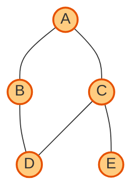

# Day 17: Hashing (Dicts, Sets) and Graphs (Representation, DFS, BFS)

Welcome to Day 17 of the Python Mastery Course. Today, we delve into powerful data structures for fast lookups and complex relationships.

---

## 1. What is Hashing? (Dictionaries and Sets)

Hashing is a concept used to map data of arbitrary size to fixed-size values. In Python, hashing is the engine behind `dict` (dictionaries) and `set` (sets). It allows for **O(1)** average time complexity for lookups, insertions, and deletions!

### Visualization: How a Hash Table Works

```mermaid
flowchart LR
    A[Key: "Alice"] -->|Hash Function| B(Index: 2)
    C[Key: "Bob"] -->|Hash Function| D(Index: 0)
    
    subgraph Hash Table / Array
        I0[0: "Bob" -> 85]
        I1[1: Empty]
        I2[2: "Alice" -> 92]
        I3[3: Empty]
    end
    
    B --> I2
    D --> I0
```

- **Dictionaries (`dict`):** Key-value pairs. Keys must be immutable (like strings or numbers) and are hashed.
- **Sets (`set`):** Unordered collections of unique elements. Think of them as dictionaries with only keys.

### 🛠️ Code Explanation & Dry Run: Dicts and Sets

```python
# Using a set for fast lookup
seen_users = {"Alice", "Bob"}       # Step 1
seen_users.add("Charlie")           # Step 2

# Using a dict to map user to score
scores = {"Alice": 92, "Bob": 85}   # Step 3
if "Alice" in scores:               # Step 4
    alice_score = scores["Alice"]   # Step 5
```

**Dry Run Analysis:**
- **Step 1:** A set is created. Python hashes "Alice" and "Bob" to place them in memory.
- **Step 2:** "Charlie" is hashed and added to the set.
- **Step 3:** A dict is created. Keys are hashed to store the values `92` and `85`.
- **Step 4:** Checking `in` operation. Python hashes "Alice", goes straight to that memory location. O(1) time!
- **Step 5:** Retrieves the value `92`.

---

## 2. Introduction to Graphs

A **Graph** is a non-linear data structure consisting of **Vertices** (or nodes) connected by **Edges**. They are perfect for modeling networks: social networks, maps, internet routing, etc.



---

## 3. Graph Representation

How do we store this graph in code? There are two main ways: Adjacency Matrix and Adjacency List.

### A. Adjacency Matrix
A 2D array of size V x V (where V is the number of vertices). If there's an edge from i to j, `matrix[i][j] = 1`.

### B. Adjacency List (Using Hashing!)
A dictionary where each key is a node, and the value is a list (or set) of its neighbors. This is highly space-efficient for sparse graphs.

```python
# Adjacency List for the graph above
graph = {
    'A': ['B', 'C'],
    'B': ['A', 'D'],
    'C': ['A', 'D', 'E'],
    'D': ['B', 'C'],
    'E': ['C']
}
```

---

## 4. Graph Traversals: BFS and DFS

Traversing a graph means visiting every node exactly once. We use **BFS** (Breadth-First Search) and **DFS** (Depth-First Search).

### Visualization: BFS vs DFS

```mermaid
flowchart LR
    subgraph BFS (Queue-based, Level by Level)
        direction TB
        A1((A)) --> B1((B))
        A1 --> C1((C))
        B1 --> D1((D))
        C1 --> E1((E))
        style A1 fill:#ffcc80
        style B1 fill:#81d4fa
        style C1 fill:#81d4fa
        style D1 fill:#a5d6a7
        style E1 fill:#a5d6a7
    end
    
    subgraph DFS (Stack-based, Go Deep Fast)
        direction TB
        A2((A)) --> B2((B))
        B2 --> D2((D))
        A2 --> C2((C))
        C2 --> E2((E))
        style A2 fill:#ffcc80
        style B2 fill:#81d4fa
        style D2 fill:#a5d6a7
        style C2 fill:#ce93d8
        style E2 fill:#bcaaa4
    end
```

### 🛠️ Code Explanation & Dry Run: BFS Implementation

BFS uses a Queue to keep track of nodes to visit next.

```python
from collections import deque

def bfs(graph, start_node):
    visited = set()                  # Step 1: Use a set for O(1) lookups
    queue = deque([start_node])      # Step 2: Initialize queue
    visited.add(start_node)
    
    result = []
    while queue:                     # Step 3: Loop while queue is not empty
        node = queue.popleft()       # Step 4: Dequeue
        result.append(node)
        
        for neighbor in graph[node]: # Step 5: Check neighbors
            if neighbor not in visited:
                visited.add(neighbor)
                queue.append(neighbor)
    return result
```

**Dry Run Analysis (Starting at 'A'):**
| Step | `queue` state | `visited` set | `result` list | Current `node` |
| :--- | :--- | :--- | :--- | :--- |
| Initialization | `['A']` | `{'A'}` | `[]` | None |
| Pop | `[]` | `{'A'}` | `['A']` | `'A'` |
| Neighbors of A | `['B', 'C']` | `{'A', 'B', 'C'}` | `['A']` | `'A'` |
| Pop | `['C']` | `{'A', 'B', 'C'}` | `['A', 'B']` | `'B'` |
| Neighbors of B | `['C', 'D']` | `{'A', 'B', 'C', 'D'}` | `['A', 'B']` | `'B'` |

---

## 🚀 Mini-Project: Social Network Analyzer

Let's use our knowledge of Graphs and Sets to analyze a mini social network!

```python
# 1. Graph Representation (Adjacency List using dict)
network = {
    "Alice": ["Bob", "Charlie"],
    "Bob": ["Alice", "David"],
    "Charlie": ["Alice", "Eve"],
    "David": ["Bob"],
    "Eve": ["Charlie"]
}

# 2. Hashing (Set): Find common friends between two people
def get_common_friends(user1, user2):
    # Convert lists to sets for fast intersection
    friends1 = set(network.get(user1, []))
    friends2 = set(network.get(user2, []))
    
    # Set intersection operator &
    common = friends1 & friends2 
    return common

# 3. Graph Traversal (DFS): Can user1 reach user2 through friends?
def can_reach(start, target, visited=None):
    if visited is None:
        visited = set()
        
    if start == target:
        return True
        
    visited.add(start)
    
    for friend in network.get(start, []):
        if friend not in visited:
            if can_reach(friend, target, visited):
                return True
                
    return False

# 4. Output
print(f"Common friends (Alice, Bob): {get_common_friends('Alice', 'Bob')}")
print(f"Can David reach Eve?: {can_reach('David', 'Eve')}")
```

### 🧠 Step-by-Step Dry Run (can_reach('David', 'Eve'))

| Step / Call | Visited Set | Current Node | Next Recursive Calls |
| :--- | :--- | :--- | :--- |
| Initial Call | `{}` | `David` | `Bob` (since Bob is David's friend) |
| Recurse | `{'David'}` | `Bob` | `Alice` |
| Recurse | `{'David', 'Bob'}` | `Alice` | `Charlie` |
| Recurse | `{'David', 'Bob', 'Alice'}` | `Charlie` | `Eve` |
| Recurse | `{'David', 'Bob', 'Alice', 'Charlie'}` | `Eve` | Target Found! Returns `True` |

> [!TIP]
> **Why use Sets for `visited`?** In Graph Traversal, you constantly check "Have I visited this node?". Using a `list` would take O(N) time to search, slowing down the algorithm. A `set` takes O(1) time, making your DFS/BFS lightning fast!
