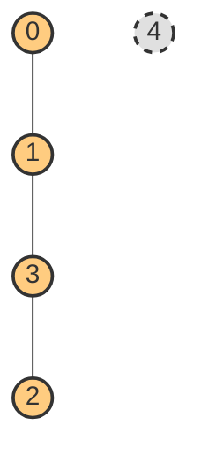
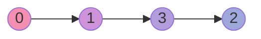
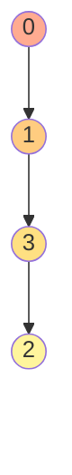

# Graph Traversal Visualization (Day 17)

This document visualizes the graph structure and the DFS/BFS traversals based on the provided Python code.

## 1. The Graph Structure

The graph has `n = 5` nodes (0 to 4) and the following edges:
- `(1, 0)`
- `(2, 3)`
- `(1, 3)`

**Visual Representation:**

*(Node 4 is isolated as it has no edges connected to it).*

## 2. Adjacency Matrix Representation

The adjacency matrix built by the code looks like this:

|   | 0 | 1 | 2 | 3 | 4 |
|---|---|---|---|---|---|
| **0** | 0 | 1 | 0 | 0 | 0 |
| **1** | 1 | 0 | 0 | 1 | 0 |
| **2** | 0 | 0 | 0 | 1 | 0 |
| **3** | 0 | 1 | 1 | 0 | 0 |
| **4** | 0 | 0 | 0 | 0 | 0 |

## 3. Depth-First Search (DFS) Traversal
**Starting at Node `0`**

DFS goes deep into the graph before backtracking. Since the code pushes neighbors to a stack from `n-1` down to `0`, the neighbors are popped and visited in ascending order.

**Step-by-step Trace:**
1. Start at `0`. Print `0`. Neighbors of `0` are `[1]`. Push `1` to stack.
2. Pop `1`. Print `1`. Neighbors of `1` are `[0, 3]`. `0` is visited. Push `3` to stack.
3. Pop `3`. Print `3`. Neighbors of `3` are `[1, 2]`. `1` is visited. Push `2` to stack.
4. Pop `2`. Print `2`. Neighbors of `2` are `[3]`. `3` is visited. 
5. Stack is empty. Traversal ends.

**Output:** `0 1 3 2`

---

## 4. Breadth-First Search (BFS) Traversal
**Starting at Node `0`**

BFS explores the graph level by level. It visits all immediate neighbors before moving to the next level.

**Step-by-step Trace:**
1. Start at `0`. Enqueue `0`. Mark `0` visited.
2. Dequeue `0`. Print `0`. Neighbors are `[1]`. Mark `1` visited and enqueue `1`.
3. Dequeue `1`. Print `1`. Neighbors are `[0, 3]`. `0` is visited. Mark `3` visited and enqueue `3`.
4. Dequeue `3`. Print `3`. Neighbors are `[1, 2]`. `1` is visited. Mark `2` visited and enqueue `2`.
5. Dequeue `2`. Print `2`. Queue is empty. Traversal ends.

**Output:** `0 1 3 2`

*(Note: In this specific linear graph shape `0-1-3-2`, both DFS and BFS will produce the exact same traversal output because each node only has one unvisited neighbor to explore next!)*
