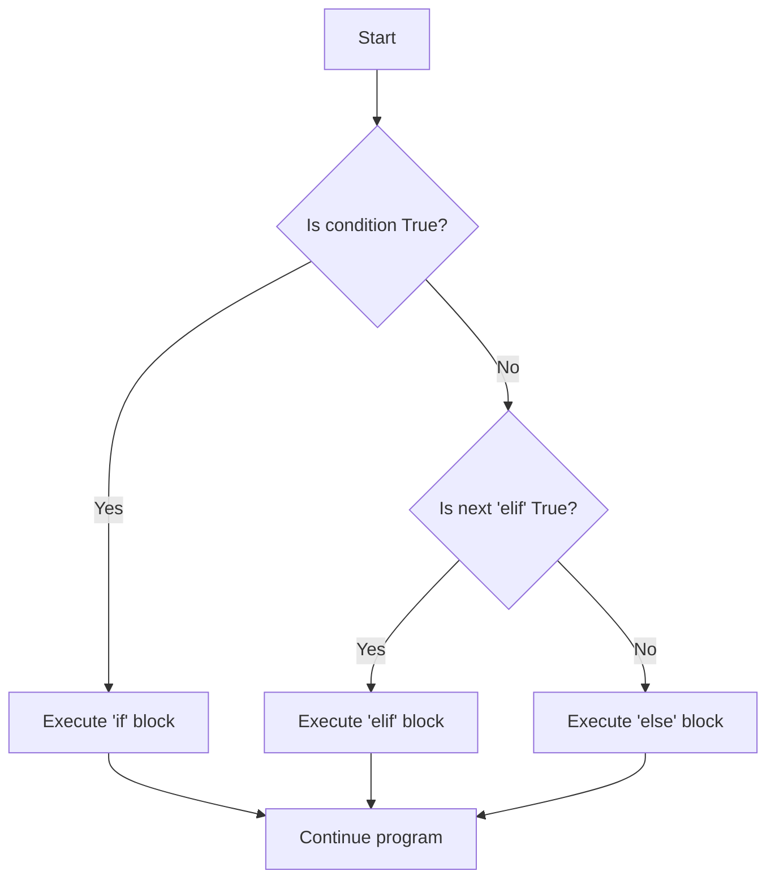

# Day 2 Detailed Notes: Control Flow (Conditionals & Loops)

Welcome to Day 2! Today we give our programs a "brain". Control flow allows code to make decisions and repeat actions, turning static scripts into dynamic applications.

---

## 1. Conditional Statements (`if`, `elif`, `else`)

Conditionals allow your code to execute different instructions based on boolean (True/False) conditions.

### Visualization: The Decision Tree


### 🛠️ Code Explanation & Dry Run

```python
temperature = 25

if temperature > 30:
    print("It's hot outside.")
elif temperature > 20:
    print("The weather is nice.")
else:
    print("It's a bit cold.")
```

**Dry Run Analysis:**
1. **Evaluation 1:** `temperature > 30` -> `25 > 30` -> `False`. Python skips the `if` block.
2. **Evaluation 2:** `temperature > 20` -> `25 > 20` -> `True`. Python enters the `elif` block.
3. **Execution:** Prints "The weather is nice."
4. **Resolution:** Since a condition was met, the `else` block is completely ignored.

---

## 2. Nested Conditionals

You can place `if` statements *inside* other `if` statements. This is useful when secondary checks are only needed if a primary condition passes.

```python
has_ticket = True
is_vip = False

if has_ticket:
    if is_vip:
        print("Enter through VIP lounge.")
    else:
        print("Enter through main gate.")
else:
    print("You cannot enter.")
```

---

## 3. The `for` Loop

A `for` loop is used to iterate over a sequence (like a list, tuple, dictionary, set, or string) a known number of times.

### Using `range()`
The `range(start, stop, step)` function is the most common companion to `for` loops.

### 🛠️ Step-by-Step Dry Run

```python
# Print even numbers from 0 to 4
for i in range(0, 5, 2):
    print(i)
```

| Iteration | Value of `i` | Output | Condition / State |
| :--- | :--- | :--- | :--- |
| Start | N/A | | `range(0, 5, 2)` generates `[0, 2, 4]` |
| 1 | 0 | `0` | Reaches end of block, loops back. |
| 2 | 2 | `2` | Reaches end of block, loops back. |
| 3 | 4 | `4` | Reaches end of block, loops back. |
| 4 | N/A | | Sequence exhausted. Loop terminates. |

---

## 4. The `while` Loop

A `while` loop executes a block of code continuously *as long as* a specific condition remains `True`.

> [!WARNING]
> Always ensure that the condition inside a `while` loop will eventually become `False`. Otherwise, you will create an **infinite loop** that freezes your program!

```python
countdown = 3
while countdown > 0:
    print(countdown)
    countdown -= 1  # Crucial: update state!
print("Liftoff!")
```

---

## 5. Loop Control Statements (`break` and `continue`)

Sometimes you need to alter the flow of a loop from the inside.

- `break`: Instantly completely terminates the loop, jumping to the code after the loop.
- `continue`: Skips the *rest* of the current iteration and jumps immediately back to the top of the loop for the next iteration.

### Code Example
```python
for num in range(1, 6):
    if num == 3:
        continue  # Skip printing 3
    if num == 5:
        break     # Stop the loop before printing 5
    print(num)
# Output: 1, 2, 4
```

---

## 🚀 Mini-Project: Star Patterns

Star patterns are the classic way to practice nested loops. 

### Solid Square
```python
size = 3
for row in range(size):
    print("* " * size)
```
*Output:*
```
* * * 
* * * 
* * * 
```

### Triangle (Nested Loop Method)
```python
rows = 4
for i in range(1, rows + 1):
    for j in range(i):
        print("*", end=" ") # end=" " prevents moving to a new line
    print() # Move to a new line after the inner loop finishes
```

**Dry Run of Nested Triangle:**
- `i = 1`: Inner loop (`j`) runs 1 time. Prints one `*`. Moves to new line.
- `i = 2`: Inner loop runs 2 times. Prints `* *`. Moves to new line.
- `i = 3`: Inner loop runs 3 times. Prints `* * *`. Moves to new line.

*Output:*
```
* 
* * 
* * * 
* * * * 
```
