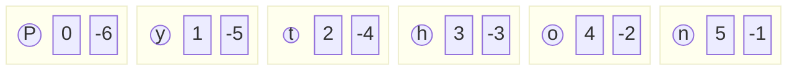
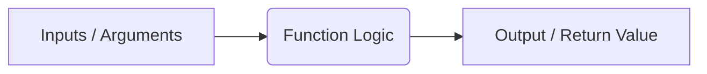

# Day 3 Detailed Notes: Strings, Lists, and Functions

Welcome to Day 3! Today we dive into extracting data from sequences (Strings and Lists) using indexing and slicing, and organizing our code into reusable blocks called Functions.

---

## 1. Sequence Indexing

Both strings and lists are ordered sequences. Every item (or character) has a specific position, called an **index**.

> [!IMPORTANT]
> Python uses **0-based indexing**. The first element is at index 0.

### Visualization: Positive and Negative Indexing


### 🛠️ Code Example
```python
word = "Python"
print(word[0])   # Output: 'P'
print(word[-1])  # Output: 'n' (Last character)

colors = ["Red", "Blue", "Green"]
print(colors[1]) # Output: 'Blue'
```

---

## 2. Sequence Slicing

Slicing allows you to extract a sub-sequence.
**Syntax:** `sequence[start : stop : step]`

- `start`: The index where the slice begins (inclusive). Defaults to 0.
- `stop`: The index where the slice ends (**exclusive**). Defaults to the end of the sequence.
- `step`: How many items to skip. Defaults to 1.

### 🛠️ Step-by-Step Dry Run

```python
text = "HelloWorld"
# Indices: 0123456789
```

| Slice | Start (Incl) | Stop (Excl) | Step | Result | Explanation |
| :--- | :--- | :--- | :--- | :--- | :--- |
| `text[0:5]` | 0 (`H`) | 5 (`W`) | 1 | `"Hello"` | Grabs characters from 0 to 4. |
| `text[5:]` | 5 (`W`) | End | 1 | `"World"` | Omitting `stop` goes to the very end. |
| `text[::2]` | 0 (`H`) | End | 2 | `"Hlool"` | Skips every other character. |
| `text[::-1]`| End | Start | -1 | `"dlroWolleH"`| **Classic Trick:** Reverses the sequence! |

---

## 3. Functions (`def`)

Functions are reusable blocks of code. They allow you to write logic once and use it many times.



### Parameters vs Arguments
- **Parameters:** The variables listed inside the parentheses in the function *definition*.
- **Arguments:** The actual values passed to the function when it is *called*.

```python
def greet(name, greeting="Hello"): # 'name' is a parameter, 'greeting' is a default parameter
    return f"{greeting}, {name}!"

print(greet("Alice"))               # Output: "Hello, Alice!" (Uses default greeting)
print(greet("Bob", "Good morning")) # Output: "Good morning, Bob!"
```

---

## 4. Arbitrary Arguments (`*args` and `**kwargs`)

Sometimes you don't know how many arguments will be passed into your function.

- `*args`: Collects positional arguments into a **Tuple**.
- `**kwargs`: Collects keyword arguments into a **Dictionary**.

```python
def make_pizza(size, *toppings, **details):
    print(f"Making a {size} inch pizza.")
    print(f"Toppings: {toppings}") # Tuple
    print(f"Details: {details}")   # Dictionary

make_pizza(12, "Pepperoni", "Mushrooms", delivery=True, tip=5)
```

---

## 5. Variable Scope

Scope defines where variables can be accessed.
- **Local Scope:** Variables created inside a function. They cannot be accessed from outside.
- **Global Scope:** Variables created outside any function. They can be read from anywhere.

```python
x = 10 # Global

def my_func():
    y = 5 # Local
    print(x) # Can read global 'x'

my_func()
# print(y) -> ERROR! 'y' is not defined in the global scope.
```

---

## 6. Recursion

Recursion is when a function calls itself. It MUST have a **Base Case** to stop the recursion, otherwise it results in an infinite loop (RecursionError).

### 🛠️ Factorial Example & Call Stack Dry Run

```python
def factorial(n):
    if n == 1:       # Base Case
        return 1
    else:            # Recursive Step
        return n * factorial(n - 1)
```

**Dry Run for `factorial(3)`:**
1. `factorial(3)` calls `factorial(2)`. Waiting for result...
2. `factorial(2)` calls `factorial(1)`. Waiting for result...
3. `factorial(1)` hits base case! Returns `1`.
4. `factorial(2)` receives `1`. Calculates `2 * 1`. Returns `2`.
5. `factorial(3)` receives `2`. Calculates `3 * 2`. Returns `6`.
