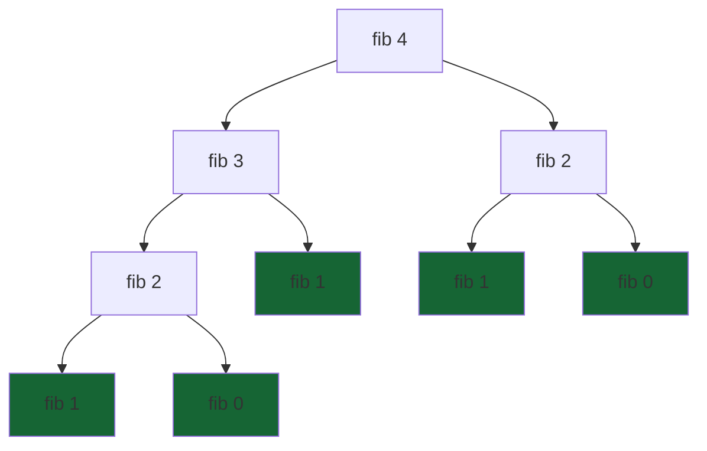

# Day 4 Detailed Notes: String Methods, Anagrams & Recursion

Welcome to Day 4! Today we supercharge our string manipulation skills, solve classic interview problems like Anagrams, and dive deeper into the mind-bending world of Recursion.

---

## 1. Essential String Methods

Strings are immutable in Python, meaning these methods **return a new string** rather than modifying the original.

### Common Methods
- `.lower()` / `.upper()`: Converts case.
- `.strip()`: Removes leading and trailing whitespace.
- `.replace(old, new)`: Replaces substrings.
- `.split(delimiter)`: Splits a string into a **list** of substrings.
- `delimiter.join(list)`: Joins a list of strings into a single string.

### 🛠️ Code Example
```python
sentence = "  Python is awesome!  "
clean_sentence = sentence.strip().replace("awesome", "powerful")
# Result: "Python is powerful!"

words = clean_sentence.split(" ") 
# Result: ["Python", "is", "powerful!"]

dashed = "-".join(words)
# Result: "Python-is-powerful!"
```

---

## 2. Solving Anagrams

An **anagram** is a word formed by rearranging the letters of a different word (e.g., "listen" and "silent").

### Approach 1: Sorting (Easy to write)
If two strings are anagrams, they must have exactly the same characters. If we sort both strings, they should be identical.

```python
def is_anagram_sort(s1, s2):
    return sorted(s1) == sorted(s2)
```
*Time Complexity: O(n log n) due to sorting.*

### Approach 2: Frequency Counting (Faster)
Count how many times each letter appears. If the counts match, they are anagrams.

```python
def is_anagram_count(s1, s2):
    if len(s1) != len(s2):
        return False
    
    count = {}
    for char in s1:
        count[char] = count.get(char, 0) + 1
        
    for char in s2:
        if char not in count or count[char] == 0:
            return False
        count[char] -= 1
        
    return True
```
*Time Complexity: O(n).*

---

## 3. Deep Dive: Recursion & The Call Stack

Recursion is when a function calls itself. The **Call Stack** is the underlying memory structure Python uses to keep track of these nested calls. It operates on a **LIFO (Last-In, First-Out)** principle.

### Visualization: The Fibonacci Recursion Tree
Calculating `fib(4)` using `fib(n) = fib(n-1) + fib(n-2)`:


*Green nodes represent Base Cases where recursion stops.*

### 🛠️ Step-by-Step Call Stack Dry Run (Factorial)

```python
def fact(n):
    if n == 1: return 1
    return n * fact(n - 1)

print(fact(3))
```

| Stack Level | Action | State |
| :--- | :--- | :--- |
| **Top (Active)** | `fact(1)` | Base case met. Returns `1` to caller. |
| **Middle** | `fact(2)` | Waiting for `fact(1)`. Receives `1`. Returns `2 * 1 = 2`. |
| **Bottom** | `fact(3)` | Waiting for `fact(2)`. Receives `2`. Returns `3 * 2 = 6`. |

> [!WARNING]
> Without a base case (like `n == 1`), the stack will keep growing until Python crashes with a `RecursionError` (Stack Overflow).
