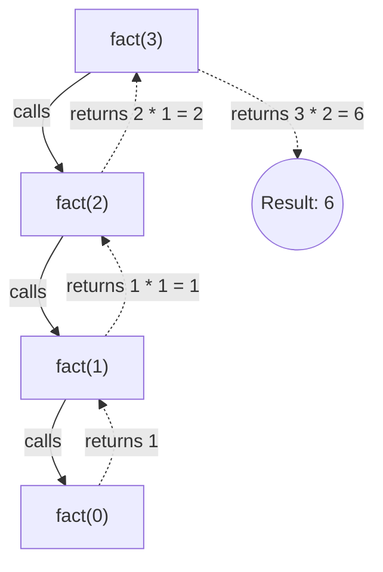
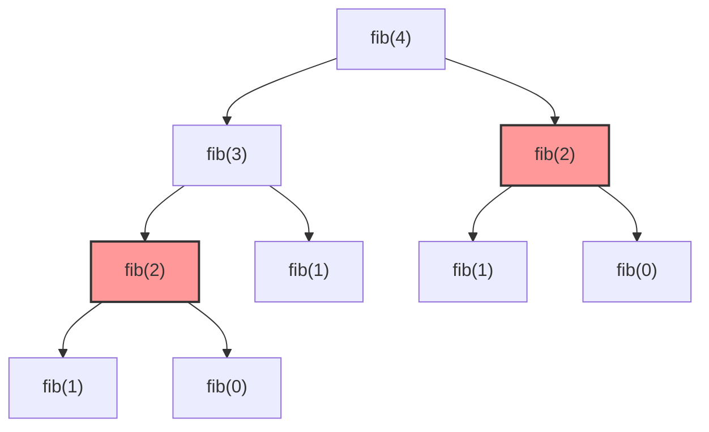

# Day 4: Recursion Visualizations

Understanding recursion is much easier when you can visualize the Call Stack and the Recursion Tree. Below are visual representations of common recursive algorithms.

## 1. Factorial Recursion Tree & Call Stack
A linear recursion tree where each call waits for the next one to complete.

## 2. Fibonacci Recursion Tree (Overlapping Subproblems)
Notice how `fib(2)` is calculated multiple times. This is why naive recursive Fibonacci is slow!

*(Nodes in red highlight overlapping subproblems - the exact same calculation being performed multiple times).*
