# Day 5 Detailed Notes: List Methods & Algorithms

Welcome to Day 5! Today we master Python's most versatile data structure: the List. We will explore its built-in methods and use it to solve fundamental algorithmic problems.

---

## 1. List Methods

Unlike Strings, Lists are **mutable**. This means list methods usually modify the list *in-place* and return `None`.

### Adding Elements
- `.append(x)`: Adds `x` to the end.
- `.extend(iterable)`: Appends all elements from `iterable` to the end.
- `.insert(i, x)`: Inserts `x` at index `i`.

### Removing Elements
- `.remove(x)`: Removes the *first* occurrence of `x`. (Throws ValueError if not found).
- `.pop([i])`: Removes and returns the item at index `i`. If `i` is omitted, removes the last item.
- `.clear()`: Removes all items.

### Other Utilities
- `.index(x)`: Returns the index of the first occurrence of `x`.
- `.count(x)`: Returns the number of times `x` appears.
- `.sort()`: Sorts the list in-place.
- `.reverse()`: Reverses the list in-place.

---

## 2. Input Processing

In coding interviews, you often receive input as a single string of space-separated numbers.

```python
# Raw input: "10 20 30"
raw_str = input("Enter numbers: ")

# Step 1: Split into string list -> ["10", "20", "30"]
str_list = raw_str.split()

# Step 2: Convert to integers -> [10, 20, 30]
# Using map() is the fastest, cleanest way:
num_list = list(map(int, str_list))

print(num_list) # Output: [10, 20, 30]
```

---

## 3. Algorithmic Problem Solving

### Problem A: Frequency Counting
How many times does each element appear in a list?

**Strategy:** Use a Dictionary.
```python
nums = [1, 2, 2, 3, 1, 4, 2]
freq = {}

for num in nums:
    freq[num] = freq.get(num, 0) + 1

print(freq) 
# Output: {1: 2, 2: 3, 3: 1, 4: 1}
```

### Problem B: Finding Combination Pairs
How do you print every possible pair of elements in a list?

**Strategy:** Nested Loops. The inner loop starts at the outer loop's index + 1 to avoid duplicate pairs like (A, B) and (B, A), and self-pairs like (A, A).

```python
letters = ["A", "B", "C", "D"]

for i in range(len(letters)):
    for j in range(i + 1, len(letters)):
        print(f"({letters[i]}, {letters[j]})")
```

### 🛠️ Combination Pairs Dry Run

| Outer `i` | Inner `j` | Output | State |
| :--- | :--- | :--- | :--- |
| `i=0` ("A") | `j=1` ("B") | `(A, B)` | Inner loop runs from 1 to 3 |
| | `j=2` ("C") | `(A, C)` | |
| | `j=3` ("D") | `(A, D)` | |
| `i=1` ("B") | `j=2` ("C") | `(B, C)` | Inner loop runs from 2 to 3 |
| | `j=3` ("D") | `(B, D)` | |
| `i=2` ("C") | `j=3` ("D") | `(C, D)` | Inner loop runs from 3 to 3 |
| `i=3` ("D") | N/A | None | Inner loop `range(4, 4)` is empty. |

Notice how we generate exactly 6 unique pairs!

---

## 4. Visualizing List Mutation in Memory

When you pass a list to a function, you are passing a **reference** to the memory address. Modifying it inside the function modifies the original list.

```mermaid
graph LR
    A[Variable: my_list] -->|Points to| B(Memory Address: 0x1A2B)
    C[Function Param: lst] -->|Points to| B
    B --> D["[1, 2, 3]"]
    
    style B fill:#1e293b,stroke:#38bdf8
    style D fill:#0f172a,stroke:#e2e8f0
```


*Because both `my_list` and `lst` point to the exact same memory address, `lst.append(4)` permanently changes `my_list`!*
