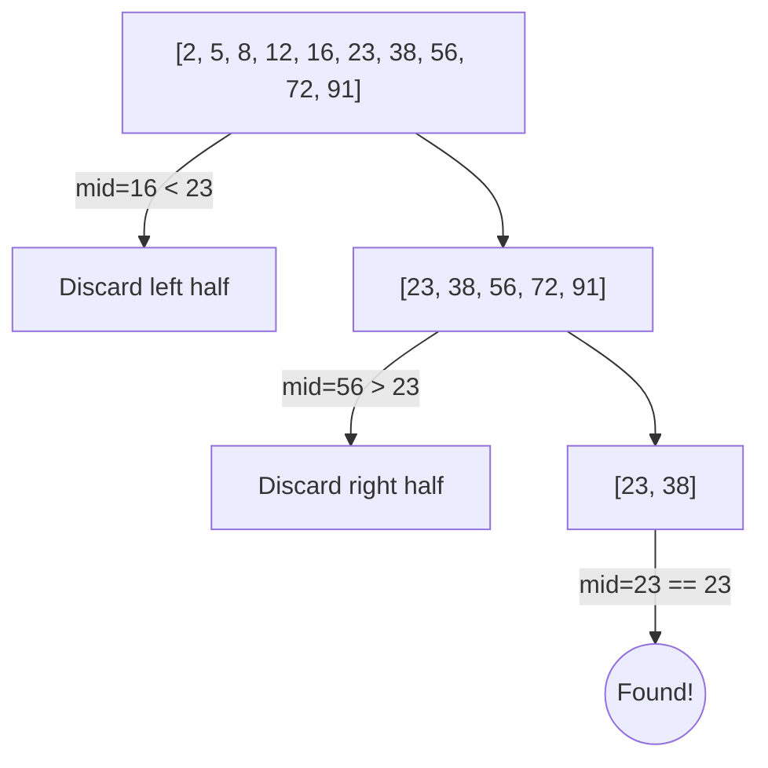

# Day 6 Detailed Notes: Big O Notation & Searching Algorithms

Welcome to Day 6! Today we step into the core of computer science: analyzing how efficient our code is using Big O Notation, and applying it to Searching Algorithms.

---

## 1. Introduction to Big O Notation

Big O Notation is how we measure the **Time Complexity** (how long it takes) and **Space Complexity** (how much memory it uses) of an algorithm as the input size ($n$) grows.

### Common Time Complexities:
- **O(1) - Constant Time:** The operation takes the same amount of time regardless of input size (e.g., accessing an element in an array by index).
- **O(log n) - Logarithmic Time:** The problem size is halved at each step (e.g., Binary Search). Extremely fast!
- **O(n) - Linear Time:** The time scales directly with the input size (e.g., a standard `for` loop).
- **O(n^2) - Quadratic Time:** The time squares with the input size (e.g., nested `for` loops).

---

## 2. Linear Search

Linear search is the simplest searching algorithm. You check every single element one by one until you find the target.

### Algorithm
```python
def linear_search(arr, target):
    for i in range(len(arr)):
        if arr[i] == target:
            return i  # Found at index i
    return -1 # Not found
```

### Complexity Analysis
- **Best Case:** O(1) if the target is the very first element.
- **Worst Case:** O(n) if the target is the last element or not in the array.

---

## 3. Binary Search

Binary Search is a "divide and conquer" algorithm. 
> [!IMPORTANT]
> The array **MUST BE SORTED** for Binary Search to work!

Instead of checking every element, we check the middle element. If it matches, we are done. If the target is smaller, we discard the right half. If the target is larger, we discard the left half.

### Algorithm
```python
def binary_search(arr, target):
    left = 0
    right = len(arr) - 1
    
    while left <= right:
        mid = (left + right) // 2
        
        if arr[mid] == target:
            return mid
        elif arr[mid] < target:
            left = mid + 1  # Discard left half
        else:
            right = mid - 1 # Discard right half
            
    return -1
```

### 🛠️ Binary Search Dry Run

Let's trace `binary_search([2, 5, 8, 12, 16, 23, 38, 56, 72, 91], 23)`

| Step | `left` | `right` | `mid` | `arr[mid]` | Condition | Action |
| :--- | :--- | :--- | :--- | :--- | :--- | :--- |
| **1** | 0 | 9 | 4 | `16` | `16 < 23` | `left = mid + 1` (left becomes 5) |
| **2** | 5 | 9 | 7 | `56` | `56 > 23` | `right = mid - 1` (right becomes 6) |
| **3** | 5 | 6 | 5 | `23` | `23 == 23` | Target found! Return `5`. |

### Visualization



### Complexity Analysis
- **Time Complexity:** O(log n). If you have 1 million items, it takes at most ~20 steps to find the target!
- **Space Complexity:** O(1) for the iterative version.
