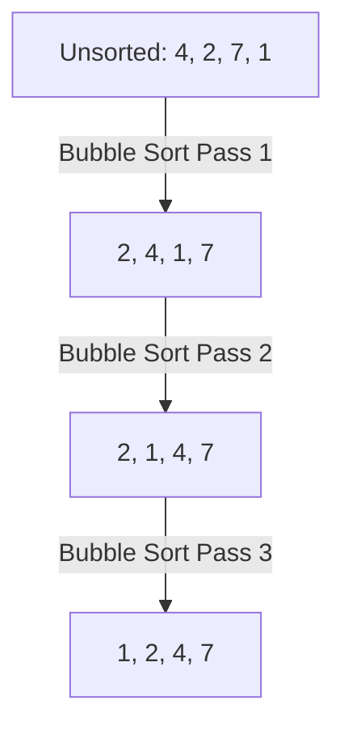

# Day 7 Detailed Notes: Space Complexity & Sorting Algorithms

Welcome to Day 7! Today we learn how to measure the memory our programs use (Space Complexity) and explore the foundational algorithms for arranging data in order (Sorting).

---

## 1. Space Complexity

Space complexity measures the total amount of memory an algorithm uses as the input size ($n$) grows.

- **Input Space:** The memory required to hold the initial input.
- **Auxiliary Space:** The *extra* temporary memory used by the algorithm (variables, call stacks). When we talk about "Space Complexity", we usually mean Auxiliary Space.

### Examples:
- **O(1) Constant Space:** You only use a few variables (e.g., `i`, `max_val`) regardless of how big the array is. Modifying an array *in-place* is O(1).
- **O(n) Linear Space:** You create a brand new list that scales with the size of the input.

---

## 2. Array Traversal Techniques

Before sorting, it's crucial to know how to scan arrays efficiently.

### Finding the Second Maximum (O(n) Time, O(1) Space)
```python
def second_max(arr):
    if len(arr) < 2: return None
    
    first = second = float('-inf')
    
    for num in arr:
        if num > first:
            second = first
            first = num
        elif num > second and num != first:
            second = num
            
    return second
```

---

## 3. Elementary Sorting Algorithms

### A. Bubble Sort
Compares adjacent elements and swaps them if they are in the wrong order. The largest elements "bubble" to the top.

```python
def bubble_sort(arr):
    n = len(arr)
    for i in range(n):
        swapped = False
        # Last i elements are already sorted
        for j in range(0, n - i - 1):
            if arr[j] > arr[j + 1]:
                arr[j], arr[j + 1] = arr[j + 1], arr[j]
                swapped = True
        if not swapped:  # Optimization: If no swaps, it's sorted!
            break
```
- **Time:** O(n^2) Worst/Average. O(n) Best (if already sorted).
- **Space:** O(1) In-place.

### B. Selection Sort
Finds the minimum element from the unsorted part and swaps it with the first unsorted element.

```python
def selection_sort(arr):
    n = len(arr)
    for i in range(n):
        min_idx = i
        for j in range(i + 1, n):
            if arr[j] < arr[min_idx]:
                min_idx = j
        # Swap the found minimum with the first element
        arr[i], arr[min_idx] = arr[min_idx], arr[i]
```
- **Time:** O(n^2) Always (even if sorted).
- **Space:** O(1) In-place.

### C. Insertion Sort
Builds the sorted array one item at a time by taking elements from the unsorted part and inserting them into their correct position in the sorted part (like sorting playing cards in your hand).

```python
def insertion_sort(arr):
    for i in range(1, len(arr)):
        key = arr[i]
        j = i - 1
        # Move elements that are greater than key, to one position ahead
        while j >= 0 and key < arr[j]:
            arr[j + 1] = arr[j]
            j -= 1
        arr[j + 1] = key
```
- **Time:** O(n^2) Worst/Average. O(n) Best (if already sorted).
- **Space:** O(1) In-place.

---

## 4. Sorting Visualized


