# Day 8 Detailed Notes: Advanced Sorting & Divide and Conquer

Welcome to Day 8! Yesterday we looked at simple O(n^2) sorting algorithms. Today, we break the quadratic time barrier using the **Divide and Conquer** paradigm to achieve blazing fast O(n log n) sorting speeds.

---

## 1. The Divide and Conquer Paradigm

Instead of tackling a massive array all at once, we:
1. **Divide** the array into smaller, manageable subproblems.
2. **Conquer** (solve) the subproblems recursively.
3. **Combine** the solutions back together.

---

## 2. Merge Sort

Merge Sort physically splits the array in half over and over until you reach arrays of size 1. Then, it merges them back together in sorted order.

### The Algorithm
```python
def merge_sort(arr):
    if len(arr) <= 1:
        return arr  # Base Case: Array of size 1 is sorted!
        
    # 1. Divide
    mid = len(arr) // 2
    left_half = arr[:mid]
    right_half = arr[mid:]
    
    # 2. Conquer (Recursive calls)
    left_sorted = merge_sort(left_half)
    right_sorted = merge_sort(right_half)
    
    # 3. Combine
    return merge(left_sorted, right_sorted)

def merge(left, right):
    result = []
    i = j = 0
    # Two-pointer approach to zip sorted arrays together
    while i < len(left) and j < len(right):
        if left[i] < right[j]:
            result.append(left[i])
            i += 1
        else:
            result.append(right[j])
            j += 1
    # Add remaining elements
    result.extend(left[i:])
    result.extend(right[j:])
    return result
```

### Visualization

```mermaid
graph TD
    A["[38, 27, 43, 3]"] -->|"Divide"| B["[38, 27]"]
    A -->|"Divide"| C["[43, 3]"]
    B -->|"Divide"| D["[38]"]
    B -->|"Divide"| E["[27]"]
    C -->|"Divide"| F["[43]"]
    C -->|"Divide"| G["[3]"]
    
    D -.->|"Merge"| H["[27, 38]"]
    E -.->|"Merge"| H
    F -.->|"Merge"| I["[3, 43]"]
    G -.->|"Merge"| I
    
    H -.->|"Merge"| J["[3, 27, 38, 43]"]
    I -.->|"Merge"| J
    
    style J fill:#1e293b,stroke:#22c55e
```


### Complexity
- **Time Complexity:** O(n log n) in all cases (Best/Worst/Average).
- **Space Complexity:** O(n). We create new arrays during the split and merge process.

---

## 3. Quick Sort

Quick Sort picks a "Pivot" element. It shifts all elements smaller than the pivot to the left, and all elements larger to the right. Then it recursively sorts the left and right sides.

### The Algorithm
```python
def quick_sort(arr):
    if len(arr) <= 1:
        return arr # Base Case
        
    pivot = arr[len(arr) // 2] # Choose middle element as pivot
    
    # Partitioning
    left = [x for x in arr if x < pivot]
    middle = [x for x in arr if x == pivot]
    right = [x for x in arr if x > pivot]
    
    # Recursive sort and combine
    return quick_sort(left) + middle + quick_sort(right)
```
*(Note: Real-world Quick Sort implementations partition the array in-place to save memory, making it slightly more complex but highly efficient space-wise).*

### Complexity
- **Time Complexity:** 
  - **Best/Avg:** O(n log n). The pivot splits the array roughly in half every time.
  - **Worst:** O(n^2). This happens if the array is already sorted and we pick the first/last element as the pivot (it splits into an array of size 0 and size N-1).
- **Space Complexity:** O(log n) auxiliary space for the recursive call stack.

---

## 4. Sorting Method Comparison

| Algorithm | Best Time | Worst Time | Space | Stable? | When to use? |
| :--- | :--- | :--- | :--- | :--- | :--- |
| **Merge Sort** | O(n log n) | O(n log n) | O(n) | **Yes** | You need guaranteed O(n log n) and have memory to spare. |
| **Quick Sort** | O(n log n) | O(n^2) | O(log n) | **No** | Default choice for in-memory arrays. Very fast in practice. |
| **Insertion Sort**| O(n) | O(n^2) | O(1) | **Yes** | Small arrays or arrays that are already mostly sorted. |
